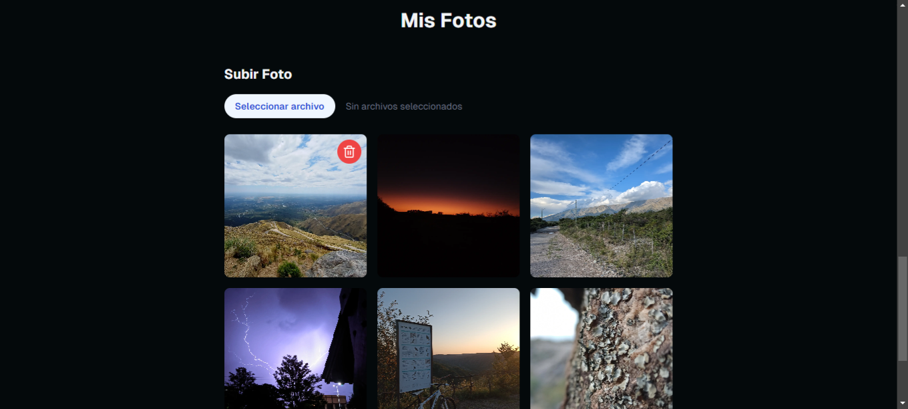

# Portfolio Personal MGC

Este es mi portafolio personal y está desarrollado con **Next.js**, **Supabase** y **TypeScript**. Aquí presento las principales características:

## Autenticación y Comentarios

- **Inicio de sesión con GitHub**: Los usuarios pueden autenticarse con su cuenta de GitHub.

- **Sistema de comentarios**: Una vez autenticados, los usuarios pueden dejar comentarios en mi portafolio. Los comentarios se almacenan y reflejan automáticamente en la base de datos.

## Cookies y Geolocalización

- **Cookies**: Se almacenan cookies para recordar información del usuario y mejorar la experiencia de navegación.

- **Geolocalización**: Utilizo geolocalización para registrar la ubicación de los usuarios. Los datos se guardan en la base de datos de Supabase mediante PostgreeSQL.

- **Registro de visitas**: Almaceno la cantidad de veces que mi perfil es visitado, identificando a los usuarios por su dirección IP, ciudad, país, etc. Se evitan duplicados de IP.

## Navegación Fluida

- **Transiciones entre páginas**: Implemento **View Transitions** para que las transiciones entre páginas sean suaves y fluidas, brindando una experiencia visual más dinámica.

## Componentes UI y Tipado

- **Componentes interactivos**: La interfaz cuenta con botones animados y movimientos personalizados, diseñados específicamente para mejorar la interacción del usuario.

- **Tipado con TypeScript**: Cada componente está fuertemente tipado con **TypeScript**, y las definiciones de props están separadas, garantizando una estructura clara y mantenible.

## Sección Privada del Usuario

- **Área de usuario**: Los usuarios autenticados tienen acceso a una sección privada.
- **Formulario interactivo**: En esta área, pueden compartir mensajes conmigo a través de un formulario, y también tienen la opción de eliminarlos o modificarlos si lo desean.
- **Estadísticas de Github**: En la sección privada tambien se dipone de una app con las estadísticas de tu perfil de Github.

## Base de Datos

- **Gestión de datos**: Toda la lógica de backend está desarrollada con PostgreeSQL en **Supabase**, asegurando un manejo eficiente y escalable de los datos del usuario y visitas.

## Sección de analítica para el perfíl del portafolio

He implementado una sección de analítica en mi dashboard privado para analizar las visitas a los perfiles. En esta sección, se recopila información sobre la IP del visitante, su ciudad, país, y la cantidad de veces que un usuario específico ha visitado el perfil.

Los datos se obtienen de mi tabla en Supabase y se integran en la aplicación.

## Gestión de Galería de Fotos 📸

Subir Fotos

La aplicación permite subir fotos a mi galería personal utilizando el servicio de almacenamiento de Supabase. El proceso es sencillo y me permite expandir mi colección de imágenes de manera rápida y segura.

Características:

- Subida de imágenes directa al bucket storage de Supabase
- Almacenamiento seguro en mi perfil privado
- Renderización automática en la galería principal

<div>

</div>

## Clonar y Usar este Proyecto

Si te gusta este template y quieres utilizarlo como base para tu propio proyecto, ¡puedes clonarlo y empezar en minutos! Sigue estos pasos:

### 1. Clonar el repositorio

```bash
git clone https://github.com/solidsnk86/personal-portfolio-mgc.git
```

2. Instalar dependencias
   Dependiendo del gestor de paquetes que prefieras, puedes usar uno de los siguientes comandos:

npm:

```bash
npm install
```

pnpm:

```bash
pnpm install
```

yarn:

```bash
yarn install
```

3. Ejecutar el servidor de desarrollo
   Una vez instaladas las dependencias, puedes iniciar el servidor de desarrollo:

```bash
npm run dev

o

pnpm run dev
```

4. Configuración de Supabase
   Asegúrate de configurar tus credenciales de Supabase en un archivo .env.local como se muestra a continuación:

```bash
NEXT_PUBLIC_SUPABASE_URL=tu-supabase-url
NEXT_PUBLIC_SUPABASE_ANON_KEY=tu-supabase-anon-key
```

5. Versión de Next.js
   Este proyecto utiliza Next.js 15.0.3, por lo que si quieres mantener la compatibilidad, asegúrate de estar utilizando esta versión o superior.

```bash
pnpm install next@15.0.3
```

```bash
npm install next@15.0.3
```

¡Y eso es todo! Ahora puedes explorar y personalizar el proyecto a tu gusto.

---

<div align="center">

  <p>solidsnk86 2024</p>
  
</div>
