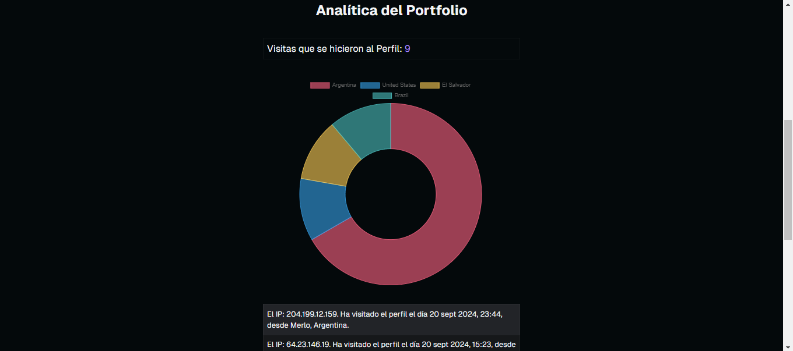

<div align="center">

| Portfolio Personal MGC |
| ---------------------- |


</div>

Este portafolio está desarrollado con **Next.js**, **Supabase** y **TypeScript**. Aquí presento las principales características:

## Autenticación y Comentarios

- **Inicio de sesión con GitHub**: Los usuarios pueden autenticarse con su cuenta de GitHub.

- **Sistema de comentarios**: Una vez autenticados, los usuarios pueden dejar comentarios en mi portafolio. Los comentarios se almacenan y reflejan automáticamente en la base de datos.

## Cookies y Geolocalización

- **Cookies**: Se almacenan cookies para recordar información del usuario y mejorar la experiencia de navegación.

- **Geolocalización**: Utilizo geolocalización para registrar la ubicación de los usuarios. Los datos se guardan en la base de datos de Supabase mediante SQL.

- **Registro de visitas**: Almaceno la cantidad de veces que un perfil es visitado, identificando a los usuarios por su dirección IP. Si la IP se repite, no se incrementa el contador.

## Navegación Fluida

- **Transiciones entre páginas**: Implemento **View Transitions** para que las transiciones entre páginas sean suaves y fluidas, brindando una experiencia visual más dinámica.

## Componentes UI y Tipado

- **Componentes interactivos**: La interfaz cuenta con botones animados y movimientos personalizados, diseñados específicamente para mejorar la interacción del usuario.

- **Tipado con TypeScript**: Cada componente está fuertemente tipado con **TypeScript**, y las definiciones de props están separadas, garantizando una estructura clara y mantenible.

## Sección Privada del Usuario

- **Área de usuario**: Los usuarios autenticados tienen acceso a una sección privada.
- **Formulario interactivo**: En esta área, pueden compartir mensajes conmigo a través de un formulario, y también tienen la opción de eliminarlos si lo desean.

## Base de Datos

- **Gestión de datos**: Toda la lógica de backend está desarrollada con SQL en **Supabase**, asegurando un manejo eficiente y escalable de los datos del usuario y visitas.

## Sección de analítica para el perfíl del portafolio

- Creé una sección de analítica en mi dashboard privado para análisis de visitas del perfil, incluyendo, su IP, su ciudad, su país y la cantidad de veces que ese id ha entrado en perfil, he usado la librería de <a href="https://www.chartjs.org/docs/latest/getting-started/usage.html" target="_blank">chart.js</a> para representar los gráficos obtenidos de mi tabla de datos en supabase e inyectarlos a al gráfico mediante un bucle for iterando los key y los values dejo un ejemplo:

```typescript
export default function ProfileClientAnalytics({ data }: { data: Array<any> }) {
  // Record en typescript se usa para poder definirlo como [key: string]: number; en este caso (key, value)
  const visitsByCountry: Record<string, number> = {};

  for (let i = 0; i < data.length; i++) {
    const country = data[i].country;
    if (visitsByCountry[country]) {
      visitsByCountry[country]++;
    } else {
      visitsByCountry[country] = 1;
    }
  }

  // Se pasan los valores obtenidos al chart
  const chartData = {
    labels: Object.keys(visitsByCountry), // Le pasamos la llave
    datasets: [
      {
        data: Object.values(visitsByCountry), // Luego los valores
        backgroundColor: [
          "rgba(255, 99, 132, 0.6)",
          "rgba(54, 162, 235, 0.6)",
          "rgba(255, 206, 86, 0.6)",
          "rgba(75, 192, 192, 0.6)",
          "rgba(153, 102, 255, 0.6)",
          "rgba(255, 159, 64, 0.6)",
        ],
        borderColor: [
          "rgba(255, 99, 132, 1)",
          "rgba(54, 162, 235, 1)",
          "rgba(255, 206, 86, 1)",
          "rgba(75, 192, 192, 1)",
          "rgba(153, 102, 255, 1)",
          "rgba(255, 159, 64, 1)",
        ],
        borderWidth: 1,
      },
    ],
  };

  // Y por último las opciones
  const chartOptions = {
    responsive: true,
    plugins: {
      legend: {
        position: "top" as const,
      },
      title: {
        display: true,
        text: "Visitas por País",
      },
    },
  };
  // Renderizamos el componente, yo usé un Doughnut
  return (
    <div className="my-10 w-full max-w-md mx-auto">
      <Doughnut data={chartData} options={chartOptions} />
    </div>
  );
}
```

### Ejemplo

<div>

</div>

## Clonar y Usar este Proyecto

Si te gusta este template y quieres utilizarlo como base para tu propio proyecto, ¡puedes clonarlo y empezar en minutos! Sigue estos pasos:

### 1. Clonar el repositorio

```bash
git clone https://github.com/solidsnk86/personal-portfolio-mgc.git
```

2. Instalar dependencias
   Dependiendo del gestor de paquetes que prefieras, puedes usar uno de los siguientes comandos:

npm:

```bash
npm install
```

pnpm:

```bash
pnpm install
```

yarn:

```bash
yarn install
```

3. Ejecutar el servidor de desarrollo
   Una vez instaladas las dependencias, puedes iniciar el servidor de desarrollo:

```bash
npm run dev

o

pnpm run dev
```

4. Configuración de Supabase
   Asegúrate de configurar tus credenciales de Supabase en un archivo .env.local como se muestra a continuación:

```bash
NEXT_PUBLIC_SUPABASE_URL=tu-supabase-url
NEXT_PUBLIC_SUPABASE_ANON_KEY=tu-supabase-anon-key
```

5. Versión de Next.js
   Este proyecto utiliza Next.js 14.2.6, por lo que si quieres mantener la compatibilidad, asegúrate de estar utilizando esta versión o superior.

```bash
npm install next@14.2.6
```

¡Y eso es todo! Ahora puedes explorar y personalizar el proyecto a tu gusto.

---

<div align="center">

  <p>solidsnk 2024</p>
  
</div>
