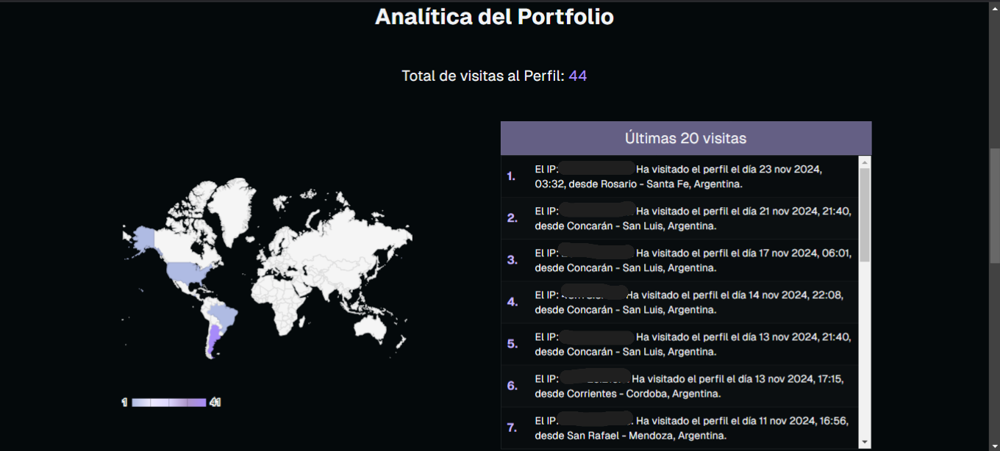

<div align="center">

| Portfolio Personal MGC |
| ---------------------- |


</div>

Este es mi portafolio personal y está desarrollado con **Next.js**, **Supabase** y **TypeScript**. Aquí presento las principales características:

## Autenticación y Comentarios

- **Inicio de sesión con GitHub**: Los usuarios pueden autenticarse con su cuenta de GitHub.

- **Sistema de comentarios**: Una vez autenticados, los usuarios pueden dejar comentarios en mi portafolio. Los comentarios se almacenan y reflejan automáticamente en la base de datos.

## Cookies y Geolocalización

- **Cookies**: Se almacenan cookies para recordar información del usuario y mejorar la experiencia de navegación.

- **Geolocalización**: Utilizo geolocalización para registrar la ubicación de los usuarios. Los datos se guardan en la base de datos de Supabase mediante PostgreeSQL.

- **Registro de visitas**: Almaceno la cantidad de veces que un perfil es visitado, identificando a los usuarios por su dirección IP. Si la IP se repite, no se incrementa el contador.

## Navegación Fluida

- **Transiciones entre páginas**: Implemento **View Transitions** para que las transiciones entre páginas sean suaves y fluidas, brindando una experiencia visual más dinámica.

## Componentes UI y Tipado

- **Componentes interactivos**: La interfaz cuenta con botones animados y movimientos personalizados, diseñados específicamente para mejorar la interacción del usuario.

- **Tipado con TypeScript**: Cada componente está fuertemente tipado con **TypeScript**, y las definiciones de props están separadas, garantizando una estructura clara y mantenible.

## Sección Privada del Usuario

- **Área de usuario**: Los usuarios autenticados tienen acceso a una sección privada.
- **Formulario interactivo**: En esta área, pueden compartir mensajes conmigo a través de un formulario, y también tienen la opción de eliminarlos si lo desean.

## Base de Datos

- **Gestión de datos**: Toda la lógica de backend está desarrollada con PostgreeSQL en **Supabase**, asegurando un manejo eficiente y escalable de los datos del usuario y visitas.

## Sección de analítica para el perfíl del portafolio

He implementado una sección de analítica en mi dashboard privado para analizar las visitas a los perfiles. En esta sección, se recopila información sobre la IP del visitante, su ciudad, país, y la cantidad de veces que un usuario específico ha visitado el perfil.

Para la visualización de los datos, utilicé la librería <a href="https://www.chartjs.org/docs/latest/getting-started/usage.html" target="_blank">Chart.js</a>, que me permitió representar los datos de forma gráfica. Los datos se obtienen de mi tabla en Supabase y se integran en los gráficos mediante un bucle for, que itera sobre las claves y valores de los datos recopilados. A continuación, dejo un ejemplo del código que utilicé para inyectar los datos en el gráfico:

```typescript
export default function ProfileClientAnalytics({ data }: { data: Array<any> }) {
  // Record en typescript se usa para poder definirlo como [key: string]: number; en este caso (key, value)
  const visitsByCountry: Record<string, number> = {};

  for (let i = 0; i < data.length; i++) {
    const country = data[i].country;
    if (visitsByCountry[country]) {
      visitsByCountry[country]++;
    } else {
      visitsByCountry[country] = 1;
    }
  }

  // Se pasan los valores obtenidos al chart
  const chartData = [
    ["Country", "Visits"],
    ...Object.entries(visitsByCountry).map(([country, visits]) => [
      country,
      visits,
    ]),
  ];

  const colorPalettes = {
    ocean: ["#E6F2FF", "#BAE6FD", "#7DD3FC", "#38BDF8", "#0EA5E9"],
    forest: ["#ECFDF5", "#D1FAE5", "#6EE7B7", "#10B981", "#059669"],
    sunset: ["#FEF3C7", "#FDE68A", "#FCD34D", "#F59E0B", "#D97706"],
    berry: ["#AFBBE3", "#EDE9FE", "#DDD6FE", "#AC94C9", "#A78BFA"],
    monochrome: ["#F4F4F4", "#E5E5E5", "#A3A3A3", "#737373", "#404040"],
  };

  const chartOptions = {
    title: "Visitas por País",
    backgroundColor: "#04090B",
    colorAxis: {
      colors: colorPalettes.berry,
    },
    legend: {
      textStyle: {
        color: "#333",
      },
    },
    titleTextStyle: {
      color: "#f4f4f4",
    },
  };
  // Renderizamos el componente, yo usé un Geo Chart de Google React Charts
  return (
    <Chart
      chartType="GeoChart"
      width="100%"
      height="400px"
      data={chartData}
      options={{
        ...chartOptions,
        width: mobile ? 360 : 400,
        height: 400,
      }}
    />
  );
}
```

### Ejemplo:

<div>

</div>

## Clonar y Usar este Proyecto

Si te gusta este template y quieres utilizarlo como base para tu propio proyecto, ¡puedes clonarlo y empezar en minutos! Sigue estos pasos:

### 1. Clonar el repositorio

```bash
git clone https://github.com/solidsnk86/personal-portfolio-mgc.git
```

2. Instalar dependencias
   Dependiendo del gestor de paquetes que prefieras, puedes usar uno de los siguientes comandos:

npm:

```bash
npm install
```

pnpm:

```bash
pnpm install
```

yarn:

```bash
yarn install
```

3. Ejecutar el servidor de desarrollo
   Una vez instaladas las dependencias, puedes iniciar el servidor de desarrollo:

```bash
npm run dev

o

pnpm run dev
```

4. Configuración de Supabase
   Asegúrate de configurar tus credenciales de Supabase en un archivo .env.local como se muestra a continuación:

```bash
NEXT_PUBLIC_SUPABASE_URL=tu-supabase-url
NEXT_PUBLIC_SUPABASE_ANON_KEY=tu-supabase-anon-key
```

5. Versión de Next.js
   Este proyecto utiliza Next.js 14.2.6, por lo que si quieres mantener la compatibilidad, asegúrate de estar utilizando esta versión o superior.

```bash
npm install next@14.2.6
```

¡Y eso es todo! Ahora puedes explorar y personalizar el proyecto a tu gusto.

---

<div align="center">

  <p>solidsnk86 2024</p>
  
</div>
